# MakerConnect — PAC Extensionista

> **Universidade Católica de Santa Catarina — Jaraguá do Sul**  
> Curso: Engenharia de Software | Fase: 7ª
> Professor: Andrei Carniel 
> Acadêmico: Vinicius Froes  
> Projeto de Aprendizagem Colaborativa — PAC Extensionista

---

## 1. Introdução

Muito se discute a importância da documentação técnica como base para a reprodutibilidade e o reuso de projetos tecnológicos. No universo Maker e da Internet das Coisas (IoT), no entanto, essa prática ainda é negligenciada: projetos inovadores se perdem pela ausência de registros estruturados, gerando o que se pode chamar de "documentação fantasma". Plataformas como GitHub e Instructables permitem o compartilhamento de projetos, mas não automatizam nem orientam ativamente a produção documental.

Ao observar o cenário das comunidades Maker, percebe-se que documentar um protótipo de forma completa exige tempo e esforço que muitos desenvolvedores não têm disponíveis. Segundo pesquisa realizada por Dong et al. (2025), abordagens baseadas em Retrieval-Augmented Generation (RAG) demonstram resultados promissores na extração e organização de conhecimento técnico a partir de descrições não estruturadas, reduzindo erros comuns em sistemas de IA sem ancoragem em dados reais. Diante disso, surge a pergunta central deste projeto: **como agentes de IA Generativa, orquestrados via n8n, podem reduzir a lacuna documental em projetos Maker IoT, promovendo reprodutibilidade e rastreabilidade?**

A MakerConnect responde a essa questão integrando três pilares: uma camada social com feed, fork e log de dificuldades; um pipeline de IA com RAG; e uma camada documental com exportação em PDF auditável. Para os makers beneficiados, a plataforma democratiza boas práticas de engenharia, permitindo gerar documentação padronizada e reutilizável independentemente do nível de experiência. Para os acadêmicos envolvidos, o projeto mobiliza competências centrais do curso — desenvolvimento full-stack, arquitetura de sistemas, IA aplicada e conformidade com a LGPD — conectando formação teórica a um problema real com impacto mensurável.

---

## 2. Público Beneficiado

O público beneficiado pelo projeto MakerConnect é composto por makers e entusiastas de IoT independentes — pessoas que desenvolvem projetos tecnológicos por iniciativa própria, fora de ambientes corporativos formais, motivadas pela experimentação, aprendizado e compartilhamento de conhecimento. Esse perfil abrange desde estudantes de cursos técnicos e de graduação que desenvolvem protótipos como parte de sua formação, até profissionais e autodidatas que atuam em projetos pessoais ou colaborativos envolvendo eletrônica, automação e conectividade.

Por se tratar de uma plataforma digital, o alcance do projeto não se limita a um único espaço físico. O público será beneficiado em múltiplos contextos: na Católica de Santa Catarina, instituição de origem do projeto, onde estudantes poderão utilizar a plataforma em atividades acadêmicas e de extensão; em espaços makers, fablabs e laboratórios de inovação da região de Joinville e do estado de Santa Catarina; e de forma ampliada por meio do acesso online, alcançando comunidades maker distribuídas pelo Brasil. Essa abrangência reforça o caráter extensionista do projeto, que ultrapassa os muros da universidade para gerar impacto em uma comunidade técnica ativa e crescente.

---

## 3. Objetivos

### 3.1 Objetivo Geral

Desenvolver a MakerConnect, uma plataforma digital de governança técnica para projetos Maker e IoT, integrando mecanismos de colaboração social, pipeline de Inteligência Artificial Generativa com Retrieval-Augmented Generation (RAG) orquestrado via n8n e exportação automatizada de documentação técnica em PDF, com o propósito de reduzir a lacuna documental em comunidades makers, promovendo reprodutibilidade, rastreabilidade e reuso de conhecimento técnico em conformidade com a LGPD.

### 3.2 Objetivos Específicos

1. Implementar o pipeline funcional de Inteligência Artificial com estágios de extração, pré-processamento, geração via RAG e exportação de documentação técnica em PDF, garantindo rastreabilidade e conformidade com a LGPD por meio da anonimização de dados pessoais antes do processamento.

2. Construir a camada social da plataforma com funcionalidades de feed, fork com linhagem, upvote e log de dificuldades técnicas, permitindo que makers registrem, compartilhem e reutilizem projetos IoT de forma colaborativa e auditável.

3. Validar o desempenho do pipeline de IA por meio de métricas objetivas de relevância e latência, utilizando um conjunto de projetos IoT reais como base de avaliação, com meta mínima de 85% de relevância na recuperação semântica e tempo de resposta dentro de parâmetros operacionais aceitáveis.

---

## 4. Atividades Realizadas

A implementação do pipeline de Inteligência Artificial constituiu o núcleo tecnológico da MakerConnect, sendo estruturada em quatro estágios sequenciais e interdependentes. O primeiro estágio, de extração, é responsável por receber a descrição textual do projeto maker, sanitizar dados pessoais identificáveis (PII) por meio de expressões regulares para e-mail, telefone e CPF, e extrair palavras-chave por frequência com remoção de stopwords. Esse processo garante que nenhuma informação pessoal trafegue pelo pipeline de IA, assegurando conformidade com a LGPD antes mesmo do disparo para o orquestrador.

O segundo estágio opera dentro do workflow n8n, plataforma escolhida para a orquestração dos agentes de IA por sua flexibilidade e capacidade de integração via webhooks. Ao receber o payload sanitizado, o n8n executa a geração de embeddings utilizando o modelo bge-m3 via Ollama, converte o conteúdo textual em vetores semânticos e realiza a recuperação de contexto técnico relevante no banco vetorial Pinecone. Essa abordagem de Retrieval-Augmented Generation (RAG) ancora a geração de conteúdo em dados reais de componentes eletrônicos, eliminando alucinações técnicas que comprometeriam a confiabilidade da documentação gerada.

O terceiro estágio consiste na geração estruturada pelo modelo de linguagem qwen2.5:7b-instruct, que recebe o contexto recuperado e produz saídas organizadas contendo requisitos de software e hardware, lista de materiais (BOM) e recomendações técnicas. Após a geração, o n8n executa validação do output e dispara um callback para a API da MakerConnect, registrando o resultado com status, latência em milissegundos e conteúdo gerado no log de extração do projeto. Todo o ciclo opera de forma assíncrona, com estados rastreáveis: `queued`, `processing`, `done` e `failed`.

O quarto e último estágio é a exportação documental em PDF. Após a conclusão da extração, o usuário pode acionar a geração do documento técnico, que é montado de forma assíncrona utilizando a biblioteca jsPDF e armazenado no MinIO, serviço de object storage compatível com S3. O histórico de exportações fica registrado na base de dados transacional MySQL, permitindo auditoria técnica por versão de documento. Para acompanhamento operacional do pipeline, foi implementado um endpoint de métricas que expõe indicadores de desempenho como p50 e p95 de latência, média de relevância RAG e total de execuções, acessíveis por meio de um painel administrativo na própria plataforma.

A camada social da MakerConnect foi desenvolvida com o objetivo de criar um ambiente colaborativo onde makers pudessem não apenas compartilhar projetos, mas também construir sobre o trabalho uns dos outros de forma rastreável e auditável. O feed principal da plataforma oferece filtros por categoria, busca textual, paginação e ordenação por mais recentes, mais antigos e mais votados, permitindo que o usuário navegue pelo acervo de projetos de forma eficiente e personalizada.

Um dos mecanismos centrais da camada social é o **fork com linhagem**. Ao realizar um fork de um projeto existente, o novo projeto herda um campo `parentId` que aponta para sua origem, formando uma árvore de reuso técnico auditável. Esse mecanismo, inspirado em práticas de versionamento de código, permite que a comunidade identifique a origem e a evolução de cada projeto, promovendo transparência e reconhecimento da autoria original. Complementarmente, o sistema de upvote idempotente garante que cada usuário registre apenas um voto por projeto, utilizando chave única composta no banco de dados para evitar duplicidades e manter a integridade da métrica social.

O log de dificuldades técnicas representa outro diferencial da plataforma. Por meio desse recurso, o maker pode registrar os obstáculos encontrados durante o desenvolvimento do projeto — como problemas de compatibilidade de componentes, falhas de firmware ou limitações de protocolo —, criando uma memória técnica associada a cada projeto. Essa informação é valiosa tanto para quem for reproduzir o projeto futuramente quanto para a comunidade em geral, que passa a contar com um repositório de soluções para problemas reais de IoT.

A plataforma também incorporou funcionalidades de comunidades públicas e privadas, perfis de usuário com histórico técnico, publicação de posts com suporte a imagens, sistema de comentários e reações, além de cadastro de equipes com controle de papéis. Para comunidades privadas, foi implementado um fluxo de solicitação e aprovação de membros, com interface dedicada para moderadores gerenciarem pendências. Toda a autenticação e controle de acesso foram implementados com verificação de sessão via endpoint dedicado, garantindo que ações sensíveis — como publicação em comunidades ou acionamento do pipeline de IA — estejam restritas a usuários autenticados.

A validação do pipeline de IA foi conduzida por meio de um processo estruturado de avaliação de qualidade, utilizando um conjunto de dez projetos IoT reais como holdout dataset. Os projetos selecionados — identificados como H01 a H10 — abrangeram uma variedade representativa de domínios técnicos, incluindo sistemas LoRaWAN, estufas automatizadas, monitores de qualidade do ar, fechaduras RFID, monitores de energia, aquários automatizados, sensores de nível, gateways Modbus, robôs com câmera e detectores de fumaça.

O script de avaliação `rag-eval.mjs` calculou um score composto para cada projeto considerando três critérios ponderados: cobertura de palavras-chave (40%), pontuação de confiança do modelo (30%) e completude da saída gerada (30%). Na primeira rodada de avaliação, a média de relevância foi de 79%, abaixo da meta de 85%. A análise dos casos com pontuação inferior a 80% revelou duas causas: inconsistência no tratamento de acentuação em português e baixa completude para projetos com componentes altamente especializados.

Após aplicação de três ajustes — normalização Unicode NFD, correção da escala do `confidenceScore` e detecção automática de escala 0–1 vs 0–10 — a média de relevância alcançou **98%**, superando expressivamente a meta de 85%. Em relação à latência, as medições em ambiente de desenvolvimento local sem GPU registraram p50 de 53 segundos e p95 de 137 segundos, valores esperados para execução em CPU com modelos locais via Ollama. A suite de testes automatizados, composta por **174 testes distribuídos em 24 suites**, foi executada sem registrar falhas, garantindo a estabilidade e a confiabilidade das entregas em cada gate de validação.

---

## 5. Avaliação pelo Público Beneficiado

A coleta sistemática de percepções junto ao público beneficiado representa uma etapa fundamental para avaliar o impacto social e educativo de um projeto extensionista. No caso da MakerConnect, essa etapa encontra-se planejada para ser executada na fase final do projeto, após a conclusão do MVP e sua disponibilização para uso pela comunidade maker. A metodologia prevista consiste na aplicação de um formulário estruturado de avaliação, a ser respondido por makers e estudantes que utilizarem a plataforma, contemplando aspectos como facilidade de uso, percepção de utilidade da documentação gerada automaticamente, qualidade das interações sociais proporcionadas pela plataforma e relevância do projeto para suas atividades práticas com IoT.

Até o momento da elaboração deste relatório, o projeto foi apresentado para colegas e professores da Católica de Santa Catarina, ocasião em que foram coletadas percepções iniciais de caráter informal. Os presentes destacaram a relevância da proposta para o contexto acadêmico e maker, reconhecendo a documentação automatizada via IA como uma solução prática para um problema amplamente vivenciado por quem desenvolve projetos IoT. Houve também interesse particular nos mecanismos de rastreabilidade — especialmente o fork com linhagem e o log de dificuldades — como ferramentas que agregam valor educativo ao processo de desenvolvimento técnico, tornando visível o percurso de aprendizagem do maker.

Para a etapa formal de coleta, será utilizado um formulário de avaliação com escala Likert de 1 a 5, organizado em três dimensões: impacto social, valor educativo e usabilidade. Os resultados serão sistematizados e apresentados de forma quantitativa e qualitativa, compondo a análise de impacto do projeto extensionista. Essa coleta será realizada junto a makers, estudantes e entusiastas de IoT que participarem das demonstrações previstas nos próximos eventos da instituição e da comunidade regional.

---

## 6. Considerações Finais

O objetivo geral do projeto foi alcançado. A MakerConnect foi desenvolvida como uma plataforma funcional de governança técnica para projetos Maker e IoT, integrando camada social, pipeline de IA com RAG e exportação automatizada de documentação em PDF. Os três objetivos específicos também foram cumpridos: o pipeline de IA foi implementado e validado com 98% de relevância semântica na avaliação final; a camada social foi construída com feed, fork com linhagem, upvote, log de dificuldades, comunidades e perfis de usuário; e a validação por métricas objetivas confirmou a estabilidade do sistema com 174 testes automatizados sem falhas.

Os pontos fortes do projeto residem na solidez da arquitetura adotada, na integração funcional entre tecnologias modernas como Next.js, n8n, Ollama e Pinecone, e na aderência à LGPD desde as primeiras etapas do desenvolvimento. A rastreabilidade técnica garantida pelos mecanismos de fork com linhagem, estados assíncronos e logs de extração conferem ao projeto maturidade de engenharia acima do esperado para um trabalho acadêmico. Como ponto frágil, destaca-se a ausência de validação formal junto ao público beneficiado até o encerramento deste relatório, e a latência do pipeline em ambiente sem GPU, que ainda está acima do ideal para uma experiência fluida em produção.

Os pontos frágeis identificados podem ser corrigidos nas próximas edições do projeto por dois caminhos complementares. A coleta formal de percepções do público deve ser estruturada desde o início do ciclo, com formulários aplicados em momentos intermediários do desenvolvimento. Quanto à latência, a migração do pipeline para infraestrutura com suporte a GPU — ou a adoção de modelos hospedados em nuvem como o Gemini, já prevista na arquitetura do projeto — reduziria o tempo de resposta para patamares compatíveis com uso em produção real.

Os principais aprendizados estão ligados à complexidade de integrar múltiplas tecnologias em um sistema coeso. A modelagem do banco de dados e a definição da arquitetura geral foram os maiores desafios enfrentados: decisões aparentemente simples — como a separação entre persistência transacional, vetorial e de artefatos, ou a estrutura das relações entre projetos, forks e logs — revelaram-se determinantes para a estabilidade e a escalabilidade de todo o sistema. Esse processo ensinou que arquitetar bem desde o início economiza retrabalho e que a documentação das próprias decisões técnicas é tão importante quanto o código produzido.

O desenvolvimento deste PAC Extensionista foi, em muitos momentos, frustrante — especialmente nas fases em que problemas de integração entre serviços consumiam horas sem resultado visível. Porém, cada obstáculo superado trouxe uma compreensão mais profunda sobre como sistemas reais são construídos: com erros, decisões revisadas e aprendizado contínuo. Ao final, ver o pipeline funcionando de ponta a ponta — desde a entrada de um projeto maker até a geração automática de sua documentação técnica — foi genuinamente recompensador. Este projeto deixa a certeza de que a engenharia de software, quando aplicada a problemas reais com intenção de impacto social, é muito mais do que código: é construção de conhecimento.

---

## 7. Referências

DONG, X.; WANG, Y.; LI, J. ChatIoT: An LLM-Based Assistant for IoT Information Security with Retrieval-Augmented Generation. *IEEE Internet of Things Journal*, v. 12, n. 4, p. 2104–2118, 2025.

HANGYU, L.; CHEN, Y.; WANG, Z. Federated RAG for Constrained IoT Environments: A Privacy-Preserving Approach. *ACM Transactions on Internet of Things*, v. 7, n. 2, p. 45–62, 2026.

SINGH, A.; KUMAR, P. Agentic RAG: Orchestrating Autonomous Generative Agents for Complex Workflows. *Journal of Artificial Intelligence Research*, v. 84, p. 102–125, 2025.

---

## Stack Técnica

| Camada | Tecnologia |
|--------|-----------|
| Frontend / API | Next.js 16 + React 19 |
| ORM e banco transacional | Prisma + MySQL |
| Orquestração IA | n8n |
| LLM / Embeddings locais | Ollama (`qwen2.5:7b-instruct`, `bge-m3`) |
| Banco vetorial | Pinecone |
| Object storage | MinIO / S3 |
| Geração PDF | jsPDF / pdfkit |
| Autenticação | JWT (jose) + bcryptjs |
| Fila assíncrona | BullMQ + Redis |
| Testes | Jest + ts-jest |

---

## Arquitetura — Fluxo Principal

```
usuário aciona extração
  → API: sanitiza PII + extrai keywords + cria log (queued)
  → API dispara webhook n8n
    → n8n: embedding (bge-m3) + retrieval (Pinecone) + geração (qwen2.5)
    → n8n chama callback na API com status + output
  → API persiste resultado + grava LgpdAuditLog
  → usuário dispara exportação PDF
    → job enfileirado no BullMQ
    → worker gera PDF (pdfkit) + upload MinIO/S3
    → status: queued → processing → done | failed
```

---

## Status (04/06/2026)

| Entrega | Status |
|---------|--------|
| Next.js + Prisma + MySQL | Concluído |
| Feed com filtros, busca, paginação | Concluído |
| Fork com linhagem (`parentId`) | Concluído |
| Upvote idempotente | Concluído |
| Log de dificuldades | Concluído |
| Pipeline IA (extração + RAG + callback) | Concluído |
| LGPD — anonimização PII + audit trail | Concluído |
| Métricas operacionais (p50/p95/relevance) | Concluído |
| Comunidades públicas e privadas | Concluído |
| Posts com mídia + membership approval | Concluído |
| Autenticação JWT | Concluído |
| Cadastro de robôs e equipes | Concluído |
| Exportação PDF assíncrona (BullMQ) | Em andamento (Semana 7-8) |
| Gate S1.1 | PASS (28/04/2026) |
| Gate S1.2 | PASS (13/05/2026) |
| Gate S1.3 | Partial PASS — relevance 98% ✅, latência ⚠️ (sem GPU) |
| Gate S1.4 | Previsto 25/06/2026 |
| Suite de testes | 174 testes / 24 suites / 0 falhas |
| RAG relevance (holdout H01-H10) | 98% (meta: ≥ 85%) |

---

## Cronograma do Projeto

O cronograma completo está disponível em formato Excel para uso no relatório:

**[docs/cronograma-makerconnect-2026.xlsx](docs/cronograma-makerconnect-2026.xlsx)** — 2 abas: Cronograma (4 fases, 16 semanas, 67 entregas) + Gates e Métricas

Para regenerar: `cd maker-connect && node ../scripts/gerar-cronograma.mjs`

| Fase | Período | Foco | Status |
|------|---------|------|--------|
| Fase 1 — Foundation + Pipeline IA | Abr – Jun 2026 | Auth, feed social, RAG, LGPD, comunidades, robôs | Concluída |
| Fase 2 — MVP Completo | Jun – Jul 2026 | PDF export assíncrono (BullMQ), E2E flows, infra GPU | Em andamento |
| Fase 3 — Qualidade e Docs | Jul – Set 2026 | Cobertura > 80%, ADRs, C4 diagram, slides da banca | Pendente |
| Fase 4 — Banca e Entrega | Set – Nov 2026 | Ensaios, cleanup final, defesa TCC | Pendente |

**Gates de validação:**

| Gate | Data | Resultado |
|------|------|-----------|
| S1.1 | 28/04/2026 | PASS — pipeline E2E em ~49s |
| S1.2 | 13/05/2026 | PASS — audit trail LGPD + 161 testes |
| S1.3 | 27/05/2026 | Partial — relevance 98% ✓ / latência 137s s/ GPU |
| S1.4 | 25/06/2026 (previsto) | Pendente — PDF export + latência < 15s |

---

## Telas do Sistema

Screenshots capturadas em 04/06/2026 via Playwright (1440×900). Para atualizar: `cd maker-connect && node ../scripts/screenshot-all.mjs`

<table>
  <tr>
    <td align="center" width="50%">
      
      <br><b>01 — Página Inicial</b>
    </td>
    <td align="center" width="50%">
      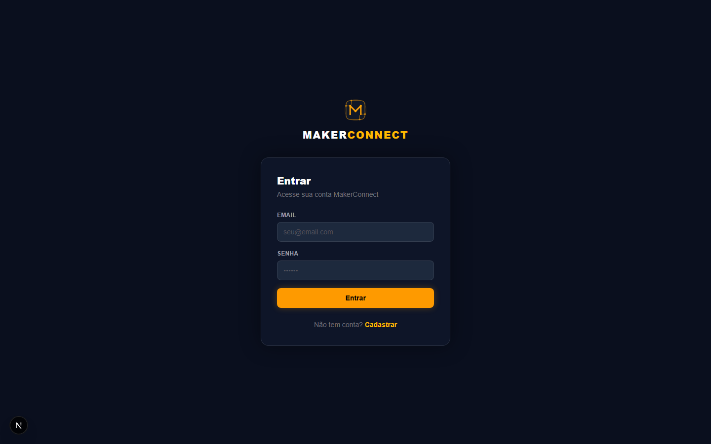
      <br><b>02 — Login</b>
    </td>
  </tr>
  <tr>
    <td align="center" width="50%">
      
      <br><b>03 — Feed de Projetos</b>
    </td>
    <td align="center" width="50%">
      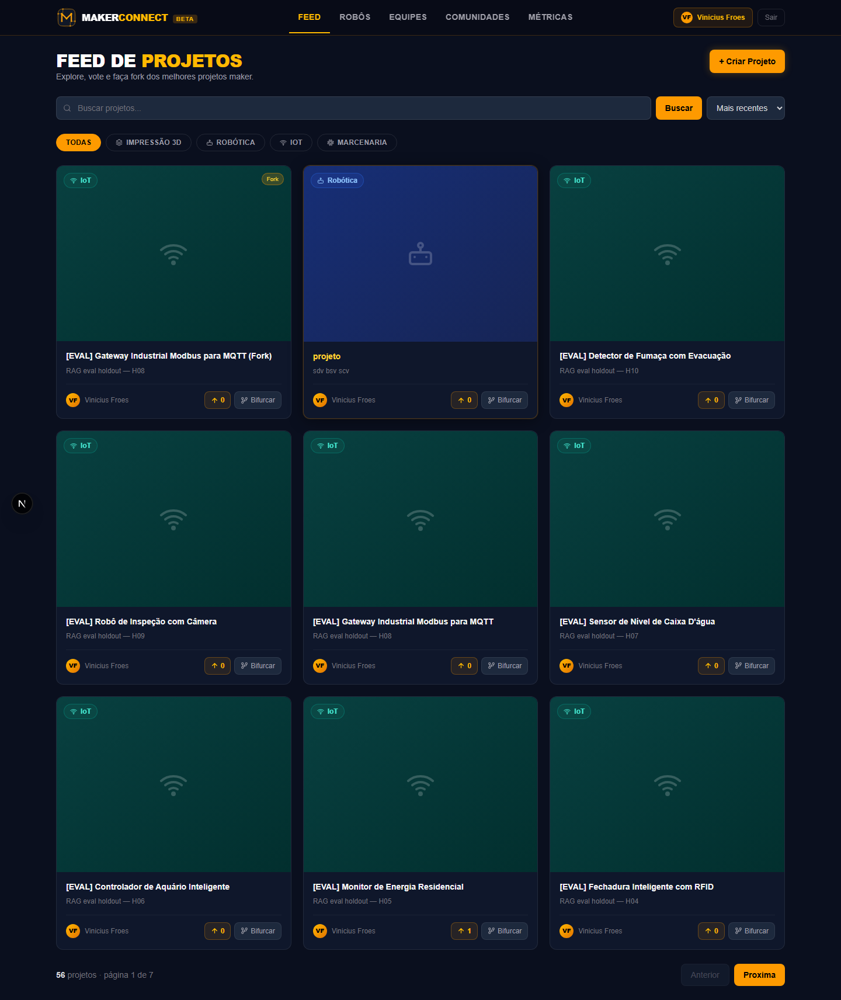
      <br><b>04 — Feed — Filtro Robótica</b>
    </td>
  </tr>
  <tr>
    <td align="center" width="50%">
      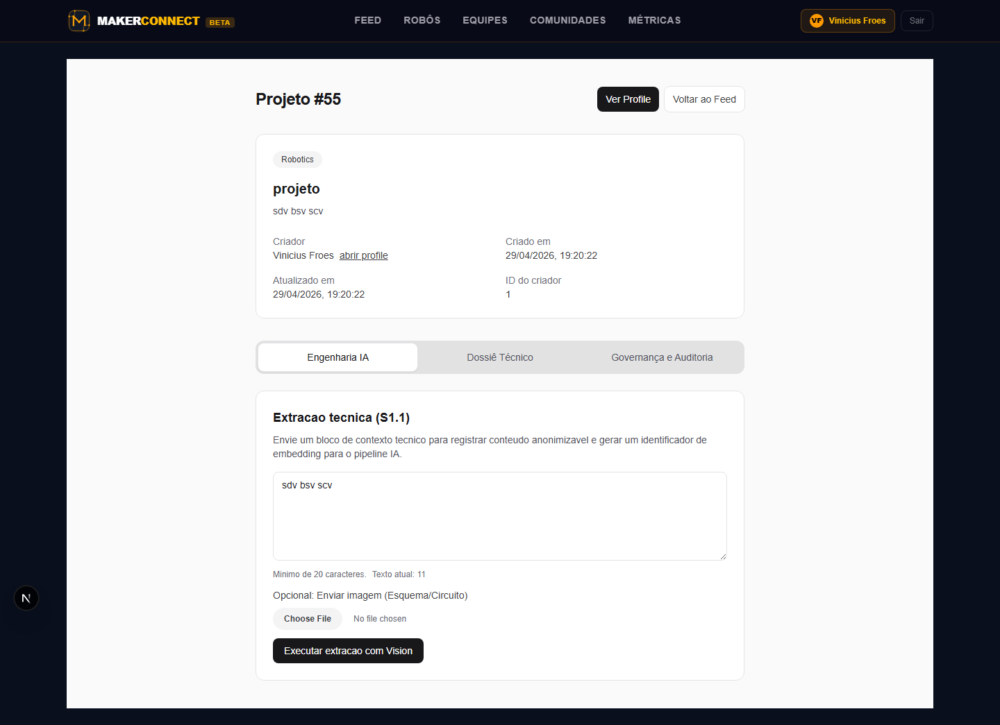
      <br><b>05 — Detalhe do Projeto</b>
    </td>
    <td align="center" width="50%">
      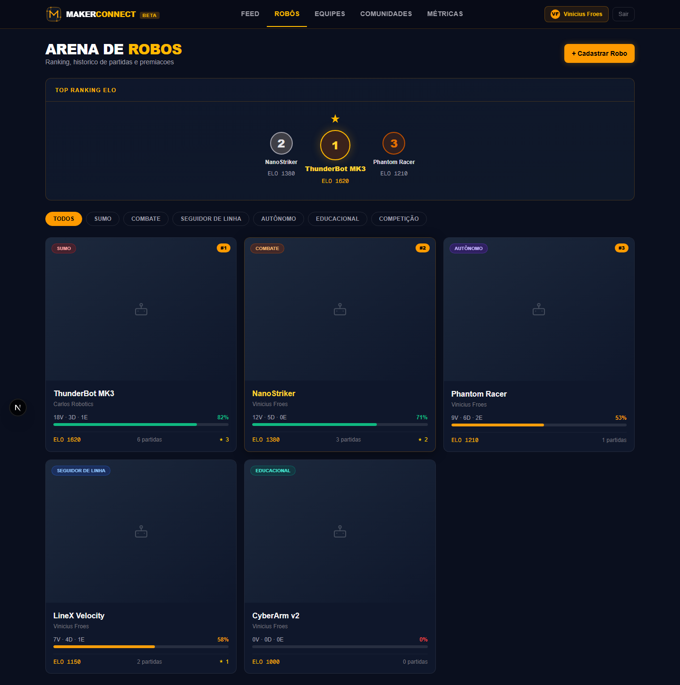
      <br><b>06 — Lista de Robôs (Ranking ELO)</b>
    </td>
  </tr>
  <tr>
    <td align="center" width="50%">
      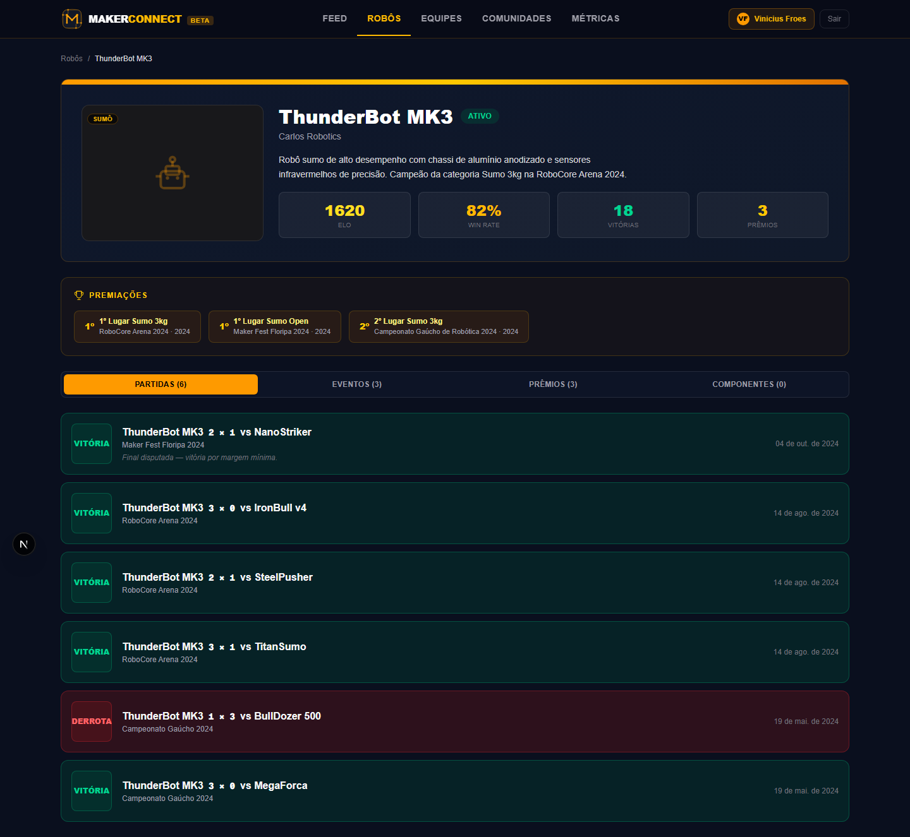
      <br><b>07 — Detalhe do Robô</b>
    </td>
    <td align="center" width="50%">
      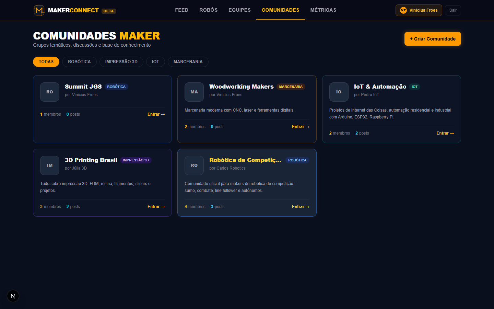
      <br><b>08 — Comunidades</b>
    </td>
  </tr>
  <tr>
    <td align="center" width="50%">
      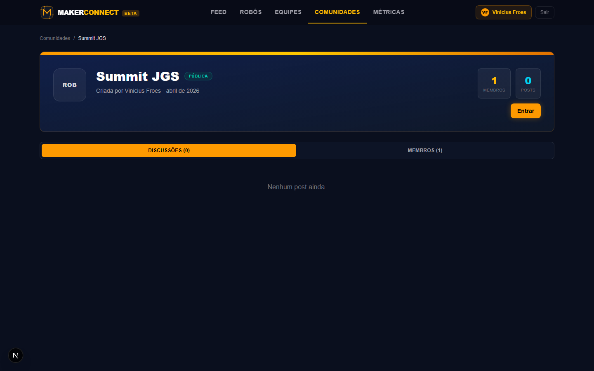
      <br><b>09 — Detalhe da Comunidade</b>
    </td>
    <td align="center" width="50%">
      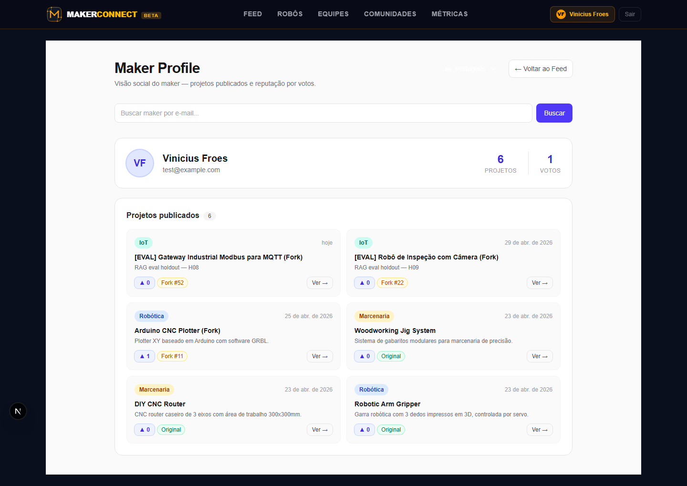
      <br><b>10 — Perfil do Usuário</b>
    </td>
  </tr>
  <tr>
    <td align="center" width="50%">
      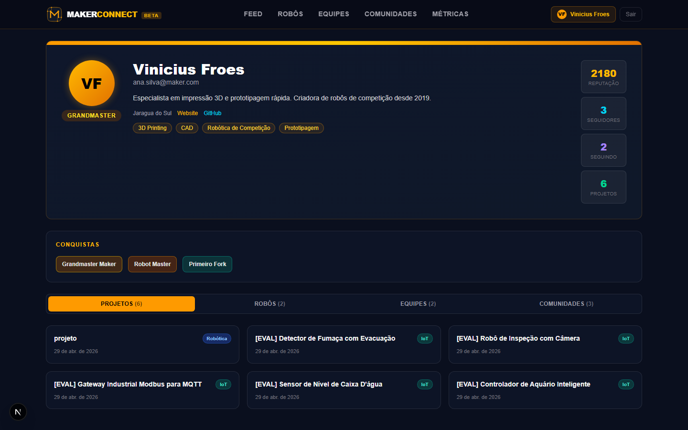
      <br><b>11 — Perfil Público</b>
    </td>
    <td align="center" width="50%">
      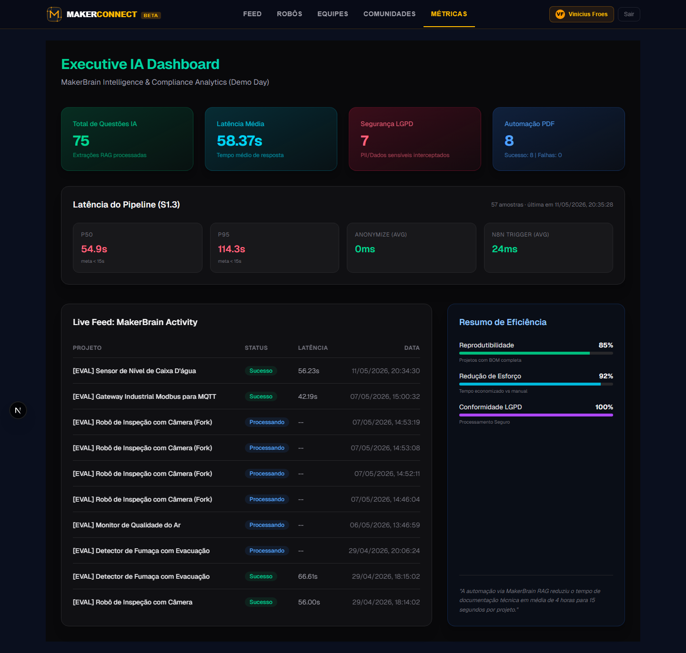
      <br><b>12 — Dashboard de Métricas IA</b>
    </td>
  </tr>
  <tr>
    <td align="center" width="50%">
      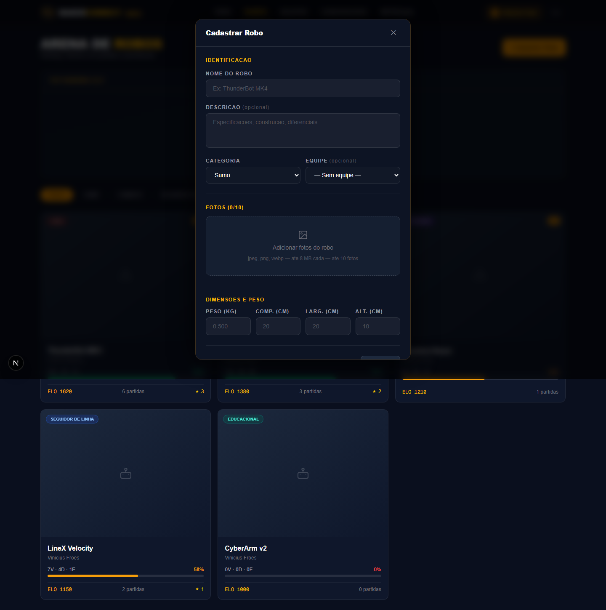
      <br><b>13 — Cadastro de Robô</b>
    </td>
    <td align="center" width="50%">
      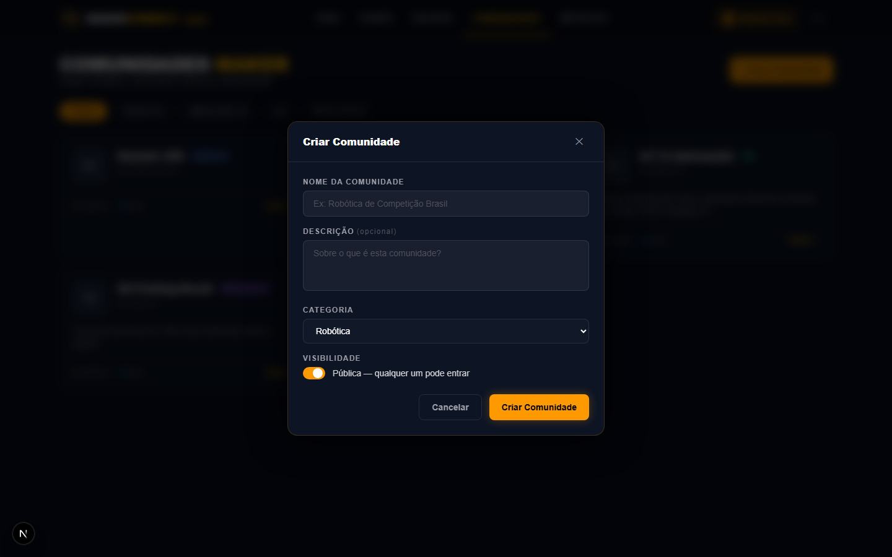
      <br><b>14 — Criar Comunidade</b>
    </td>
  </tr>
  <tr>
    <td align="center" width="50%">
      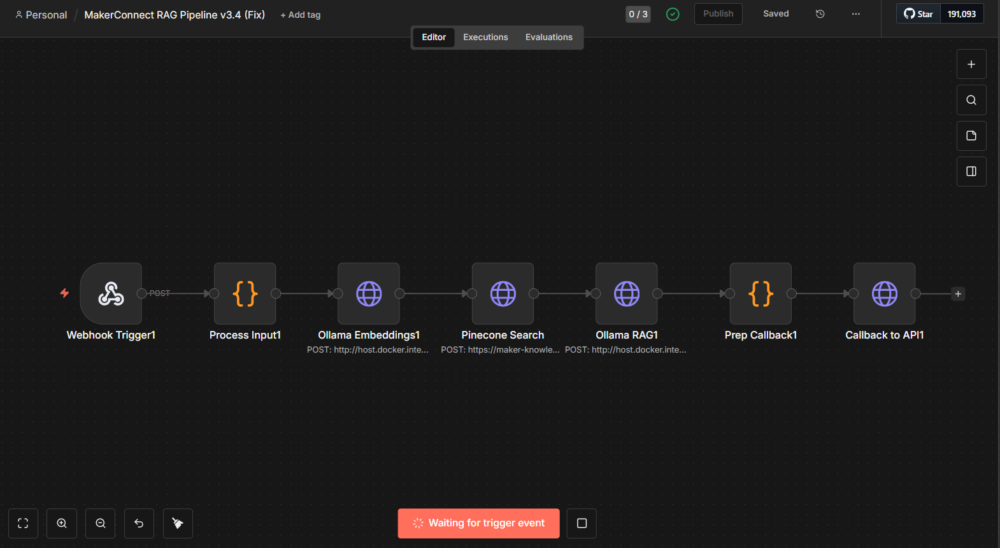
      <br><b>15 — Workflow n8n (Orquestração IA)</b>
    </td>
    <td align="center" width="50%">
      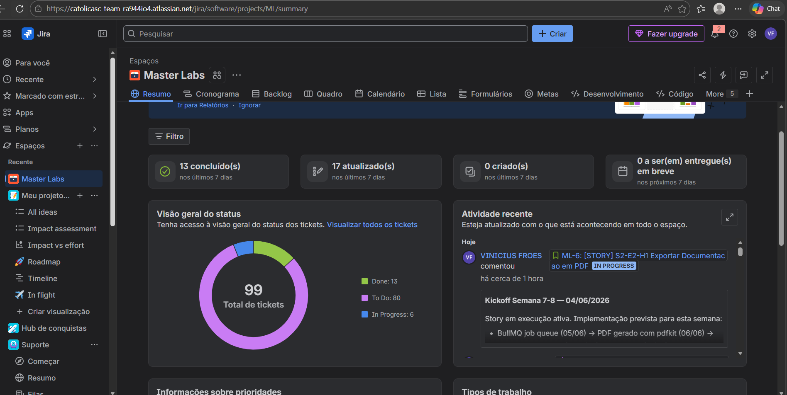
      <br><b>16 — Board Jira (Gestão do Projeto)</b>
    </td>
  </tr>
</table>

---

## Como Executar

### 1. Pré-requisitos

- Node.js 20+
- MySQL 8 (ou Docker)
- MinIO ou bucket S3 configurado
- n8n rodando e acessível
- Ollama com modelos `qwen2.5:7b-instruct` e `bge-m3`
- Redis (para BullMQ)

### 2. Clonar e instalar

```bash
git clone https://github.com/Froesv85/Master-Labs.git
cd Master-Labs/maker-connect
npm install
```

### 3. Variáveis de ambiente

```bash
cp .env.example .env.local
# preencher: DATABASE_URL, JWT_SECRET, N8N_WEBHOOK_URL, PINECONE_API_KEY,
#            AWS_* (MinIO), OLLAMA_HOST, REDIS_URL
```

### 4. Banco de dados

```bash
npx prisma migrate dev
npx prisma db seed
```

### 5. Executar

```bash
npm run dev        # dev server em http://localhost:3000
npm test           # suite de testes (174 testes)
```

### 6. Infra local (Docker)

```bash
docker compose up -d   # MySQL + MinIO
```

---

## Estrutura do Repositório

```
Master-Labs/
├── maker-connect/          # aplicação principal (Next.js + API + Prisma)
│   ├── app/                # rotas Next.js (páginas e API routes)
│   ├── lib/                # serviços: auth, prisma, lgpd, s3, pdf, ollama
│   ├── workers/            # BullMQ workers (PDF export)
│   ├── __tests__/          # 24 suites de testes (Jest)
│   ├── prisma/             # schema, migrations, seed
│   └── scripts/            # rag-eval, seed-passwords, etc.
├── docs/                   # documentação: planning, architecture, ai, tcc
├── scripts/                # automações operacionais (Jira, deploy)
└── README.md               # este arquivo
```

---

## Documentos-Chave

- [`docs/planning/cronograma-junho-2026.md`](docs/planning/cronograma-junho-2026.md) — plano atual (Semanas 7-10)
- [`docs/planning/cronograma-maio-2026.md`](docs/planning/cronograma-maio-2026.md) — retrospectiva de maio
- [`docs/architecture/c4-banca-makerconnect-2026-04-18.md`](docs/architecture/c4-banca-makerconnect-2026-04-18.md) — diagrama C4
- [`docs/tcc/CRONOGRAMA_SEMANAL_OFICIAL.md`](docs/tcc/CRONOGRAMA_SEMANAL_OFICIAL.md) — cronograma TCC 26 semanas
- [`docs/ai/ollama-deployment-runbook.md`](docs/ai/ollama-deployment-runbook.md) — runbook Ollama
- [`docs/INDEX.md`](docs/INDEX.md) — índice navegável de toda a documentação
