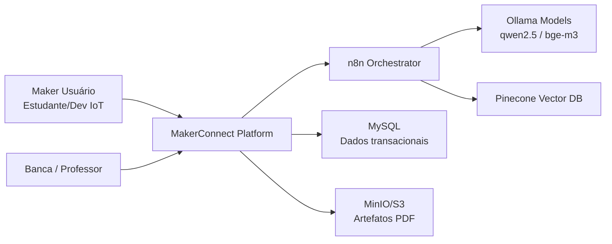
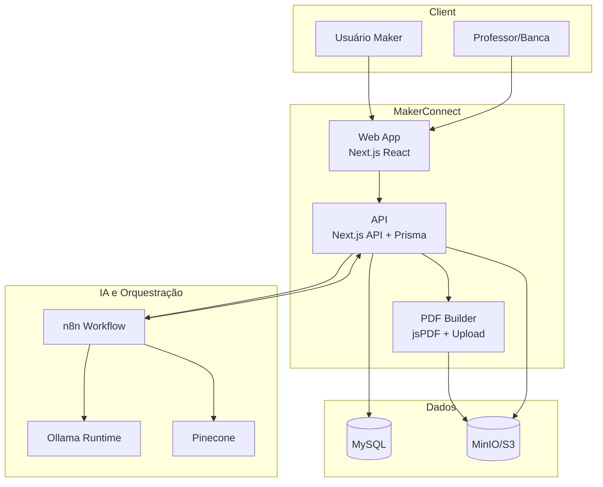
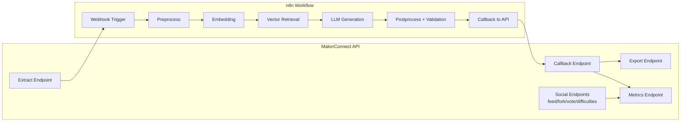

# MakerConnect - Resumo Técnico e Arquitetura C4 (Pronto para Banca)

Data: 2026-04-18  
Projeto: MakerConnect (Governança IoT com IA)

## 1. Resumo Executivo do Projeto

A MakerConnect é uma plataforma de governança técnica para projetos IoT com três pilares integrados:
- camada social (feed, fork, upvote, profile, log de dificuldades),
- camada de IA (pipeline de extração + RAG + callback),
- camada documental (exportação PDF auditável e rastreável).

Objetivo central:
- reduzir o esforço de documentação técnica em projetos maker,
- aumentar reprodutibilidade e rastreabilidade,
- manter evidência técnica verificável para evolução do projeto.

Estado atual (até agora):
- MVP funcional com fluxo ponta a ponta social + extração IA + exportação assíncrona;
- callback entre API e n8n operacional;
- rastreabilidade via logs de extração e histórico de exportação;
- stack Ollama definida para geração e embeddings no pipeline RAG;
- persistência transacional (MySQL), vetorial (Pinecone) e de artefatos (MinIO/S3).

## 2. Conceitos-Chave Aplicados

### 2.1 Governança IoT
Governança aqui significa controlar e evidenciar:
- origem e evolução de projetos (linhagem de forks),
- qualidade percebida pela comunidade (upvotes idempotentes),
- dificuldades técnicas reais encontradas na implementação,
- documentação técnica consolidada por versão de exportação.

### 2.2 RAG (Retrieval-Augmented Generation)
No MakerConnect, o RAG conecta geração de IA com evidência técnica:
1. extração do conteúdo do projeto,
2. geração de embeddings,
3. recuperação semântica de contexto técnico (Pinecone),
4. geração de saída estruturada (requisitos/BOM/código sugerido),
5. callback para API e persistência em log auditável.

### 2.3 Assíncrono com Estados
Tanto extração quanto exportação usam máquina de estados:
- queued
- processing
- done
- failed

Isso garante observabilidade e evita “silêncio operacional” no pipeline.

## 3. Algoritmos e Regras de Negócio Utilizados

### 3.1 Anonimização de PII
Entrada textual é sanitizada antes de IA usando padrões de:
- e-mail,
- telefone,
- CPF.

Saída:
- texto anonimizado,
- contador de redações (`piiRedactions`).

### 3.2 Extração de Keywords
Pipeline de keywords:
1. normalização para minúsculas,
2. remoção de pontuação,
3. remoção de stopwords,
4. contagem de frequência,
5. seleção dos top termos.

Uso prático:
- enriquecer contexto para recuperação vetorial e rastreabilidade no log.

### 3.3 Ordenação e Recuperação no Feed
Consulta do feed considera:
- filtro por categoria,
- busca textual,
- paginação,
- ordenação por newest/oldest/top.

A ordenação `top` usa contagem de votos como critério de ranqueamento.

### 3.4 Idempotência de Upvote
Regra: um voto por usuário por projeto (chave única composta).  
Efeito: elimina duplicidade e mantém consistência da métrica social.

### 3.5 Linhagem de Fork
Cada fork aponta para um `parentId`, formando árvore de reuso técnico.  
Efeito: rastreabilidade de origem e evolução do conhecimento maker.

## 4. Conceitos dos Bancos de Dados Utilizados

## 4.1 MySQL (Banco Relacional Transacional)
Papel:
- fonte de verdade do domínio (usuários, projetos, votos, dificuldades, exportações, logs de extração).

Vantagens no projeto:
- integridade referencial,
- regras de unicidade (idempotência),
- consultas estruturadas para feed e métricas operacionais.

## 4.2 Pinecone (Banco Vetorial)
Papel:
- armazenar embeddings e permitir busca por similaridade semântica.

Vantagens no projeto:
- grounding técnico para reduzir alucinação,
- recuperação de contexto relevante para geração RAG.

Ponto crítico:
- a dimensão do embedding deve ser compatível com o índice vetorial;
- troca de modelo de embedding implica reseed/reindex.

## 4.3 MinIO/S3 (Object Storage)
Papel:
- armazenamento de artefatos binários (PDF exportado, assets).

Vantagens no projeto:
- separa objeto binário da base transacional,
- simplifica distribuição e histórico de documentos.

## 5. Arquitetura C4 - Nível 1 (Contexto)

### 5.1 Visão de Contexto
A MakerConnect se posiciona entre usuário maker, serviços de IA/orquestração e infraestrutura de dados.

### 5.2 Mensagem para Slide
- Plataforma centraliza ciclo social + IA + documentação.
- RAG conecta conhecimento técnico ao conteúdo do projeto.
- Persistência separada por responsabilidade (transacional, vetorial, artefatos).

## 6. Arquitetura C4 - Nível 2 (Containers)

### 6.1 Containers Principais

| Container | Tecnologia | Responsabilidade | Entradas/Saídas |
|---|---|---|---|
| Web App | Next.js/React | UX de feed, projeto, profile, ações sociais e gatilhos de IA/PDF | HTTP com API |
| API App | Next.js API Routes + Prisma | Domínio social, extração, callback, export, métricas | JSON REST + DB |
| n8n Orchestrator | n8n | Workflow IA: embedding, retrieval, geração e callback | Webhook + HTTP |
| LLM/Embed Runtime | Ollama | Embeddings e geração estruturada | API local |
| PDF Service | jsPDF em worker assíncrono lógico | Montagem de documento técnico | Buffer PDF + upload |
| Transaction DB | MySQL | Dados de negócio e logs | SQL |
| Vector DB | Pinecone | Contexto semântico para RAG | Vetores + metadados |
| Object Storage | MinIO/S3 | Persistência de arquivos PDF/assets | URL de arquivo |

### 6.2 Diagrama de Containers

### 6.3 Mensagem para Slide
- Cada container tem responsabilidade clara.
- O pipeline IA é desacoplado do frontend por API + webhook.
- O PDF é assíncrono e rastreado por status.

## 7. Arquitetura C4 - Nível 3 (Componentes)

## 7.1 Componentes da API

| Componente | Função | Resultado |
|---|---|---|
| Feed/Projects API | Filtro, busca, ordenação e paginação | Navegação social eficiente |
| Fork API | Clona projeto com parentId | Linhagem e rastreabilidade |
| Vote API | Upvote idempotente | Métrica social consistente |
| Difficulties API | Registro de dificuldades técnicas | Memória técnica do projeto |
| Extract API | Sanitiza, gera keywords, cria log e dispara n8n | Início do pipeline RAG |
| Extract Callback API | Recebe resultado do n8n e atualiza status/output | Fechamento auditável da extração |
| Export API | Inicia geração PDF e controla estado | Documento técnico versionado |
| Metrics API | Consolida métricas IA/PDF e recentes | Observabilidade para demo |

## 7.2 Componentes do Workflow n8n

| Etapa | Responsabilidade |
|---|---|
| Webhook Trigger | Receber payload da extração |
| Preprocessamento | Normalização e preparo de contexto |
| Embedding Node | Gerar embedding (Ollama) |
| Retrieval Node | Buscar contexto semântico (Pinecone) |
| Generation Node | Gerar saída estruturada (qwen2.5) |
| Postprocessamento | Validar parse e preparar payload |
| Callback Node | Atualizar status/output na API |

## 7.3 Diagrama de Componentes (API + n8n)

### 7.4 Mensagem para Slide
- Componente crítico: `Extract Endpoint` inicia trilha IA auditável.
- Componente crítico: `Callback Endpoint` fecha ciclo com latência/status/output.
- Componente crítico: `Export Endpoint` consolida IA + histórico técnico em PDF.

## 8. Fluxo Fim a Fim (Narrativa para apresentação)

1. Maker cria ou atualiza projeto no feed social.
2. Maker aciona extração IA.
3. API anonimiza PII, extrai keywords, registra log e envia para n8n.
4. n8n executa embedding, retrieval e geração estruturada com grounding.
5. n8n envia callback para API com status, latência e output.
6. API persiste resultado e disponibiliza métricas.
7. Maker dispara export PDF.
8. Documento é gerado de forma assíncrona e armazenado no MinIO/S3.
9. Histórico de exportações e logs garante evidência para banca e operação.

## 9. Roteiro Pronto para Slides (Banca)

Slide 1 - Problema e Oportunidade
- Dor: documentação técnica incompleta em projetos maker IoT.
- Oportunidade: IA + governança para reduzir esforço e aumentar reuso.

Slide 2 - Proposta MakerConnect
- Rede social técnica com rastreabilidade e documentação automatizada.

Slide 3 - Resultado Atual do Projeto
- MVP funcional com fluxo social + IA + PDF assíncrono.

Slide 4 - C4 Contexto
- Mostrar diagrama de contexto e fronteiras externas.

Slide 5 - C4 Containers
- Mostrar containers e responsabilidades.

Slide 6 - C4 Componentes API
- Mostrar endpoints e regras de negócio críticas.

Slide 7 - C4 Componentes n8n/RAG
- Mostrar workflow e pontos de controle de qualidade.

Slide 8 - Algoritmos e Regras
- PII redaction, keywords, idempotência, linhagem de fork.

Slide 9 - Bancos de Dados
- MySQL (transacional), Pinecone (vetorial), MinIO (artefatos).

Slide 10 - Evidências Operacionais
- Status assíncronos, logs, métricas, rastreabilidade.

Slide 11 - Riscos e Mitigações
- Latência e relevância IA, fallback de modelo, monitoramento.

Slide 12 - Fechamento
- Valor acadêmico e técnico: reprodutibilidade + governança + automação.

## 10. Conclusão para banca

A arquitetura da MakerConnect é tecnicamente consistente para o objetivo proposto:
- separa responsabilidades por container,
- mantém trilha de auditoria por estado/log,
- aplica RAG com base vetorial para grounding técnico,
- integra documentação assíncrona como produto final verificável.

Em termos de pesquisa aplicada, o projeto demonstra como IA orquestrada pode reduzir lacunas de documentação em ecossistemas maker IoT sem perder rastreabilidade e governança.

## 11. Próximos Passos Executados (Jira + Demo Day)

### 11.1 Atualizações realizadas no Jira
- ML-56 -> **Concluído** (gate de estabilidade fechado).
- ML-57 -> **Em andamento** (agora refletindo bloqueio técnico).
- Epic de Fase 2 criado: **ML-64** (`[EPIC] Phase 2 - LLM Latency & Relevance Tuning`).
- Issue bloqueadora criada: **ML-65** (`[BLOCKER] Requires LLM Optimization (Phase 2)`).
- Relacionamentos aplicados:
  - ML-65 bloqueia ML-57;
  - ML-65 vinculado ao Epic ML-64 como item de backlog da Fase 2.

### 11.2 Narrativa pronta para Demo Day (3 a 5 minutos)

1. **Abertura (30s)**
- "Fechamos o gate de estabilidade do pipeline: o card ML-56 foi concluído com sucesso."

2. **Evidência técnica (60s)**
- "O fluxo assíncrono extract -> n8n -> callback está estável e rastreável por status/log."
- "A arquitetura mantém separação clara entre aplicação, orquestração IA, persistência transacional, vetorial e artefatos."

3. **Gap atual (60s)**
- "O bloqueio atual não é de estabilidade."
- "O bloqueio é de otimização de LLM para cumprir KPI de latência e relevância no benchmark (ML-57)."

4. **Plano de execução (60s)**
- "Abrimos o Epic ML-64 para fase de tuning de LLM."
- "Criamos o blocker ML-65, já ligado ao ML-57, com foco em prompt tuning, retrieval tuning, runtime/model optimization e reruns controlados de benchmark."

5. **Fechamento (30s)**
- "Resultado: entregamos estabilidade operacional e um roadmap objetivo de evolução para qualidade de IA em produção acadêmica."

### 11.3 Mensagem executiva para banca
- Estabilidade do produto: **validada e concluída**.
- Escalabilidade de qualidade IA: **planejada com backlog rastreável e priorizado**.
- Governança do projeto: **mantida por evidência técnica, estados assíncronos e trilha Jira**.
